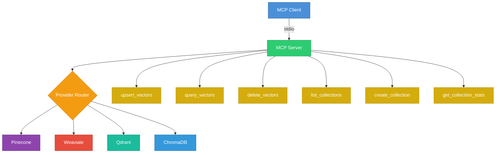

# mcp-server-vector-db

An MCP (Model Context Protocol) server for vector database operations. Provides a unified interface to interact with Pinecone, Weaviate, Qdrant, and ChromaDB through standard MCP tools.

## Architecture



## Supported Providers

| Provider | Required Config | Description |
|----------|----------------|-------------|
| **Pinecone** | `VECTOR_API_KEY` | Managed vector database with serverless support |
| **Weaviate** | `VECTOR_HOST`, `VECTOR_API_KEY` (optional) | Open-source vector search engine |
| **Qdrant** | `VECTOR_URL`, `VECTOR_API_KEY` (optional) | High-performance vector similarity engine |
| **ChromaDB** | `VECTOR_HOST` (optional) | Open-source embedding database |

## Tools

| Tool | Description |
|------|-------------|
| `upsert_vectors` | Insert or update vectors with metadata |
| `query_vectors` | Similarity search with filtering |
| `delete_vectors` | Remove vectors by ID |
| `list_collections` | List all collections |
| `create_collection` | Create a new collection with dimension and metric |
| `get_collection_stats` | Get collection statistics |

## Installation

```bash
npm install
npm run build
```

## Configuration

Set environment variables to configure the provider:

```bash
export VECTOR_PROVIDER=pinecone    # pinecone | weaviate | qdrant | chromadb
export VECTOR_API_KEY=your-key
export VECTOR_HOST=your-host
export VECTOR_URL=http://localhost:6333
```

## Usage

### Standalone

```bash
npm start
```

### Docker

```bash
docker build -t mcp-server-vector-db .
docker run -i --rm \
  -e VECTOR_PROVIDER=qdrant \
  -e VECTOR_URL=http://host.docker.internal:6333 \
  mcp-server-vector-db
```

### MCP Client Configuration

```json
{
  "mcpServers": {
    "vector-db": {
      "command": "node",
      "args": ["dist/index.js"],
      "env": {
        "VECTOR_PROVIDER": "pinecone",
        "VECTOR_API_KEY": "your-api-key"
      }
    }
  }
}
```

## License

MIT License - see [LICENSE](LICENSE) for details.
